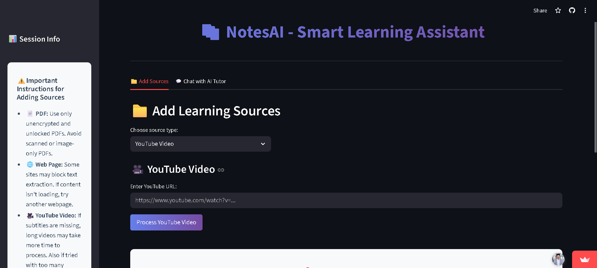

# 📚 NotesAI - Smart Learning Assistant
## 🚀 Live Demo: [Click Here](https://notesai-harsh-pilania.streamlit.app/)
## 📱DEMO Video: [Click Here](https://drive.google.com/file/d/1A75QbvEN3gimHp0v1EL6i57fBoBgg-Ty/view?usp=sharing)



A powerful **AI-driven learning companion** that transforms any content source into an interactive learning experience. Chat with YouTube videos, web pages, and PDF documents using advanced AI to get personalized explanations, summaries, and quizzes.


## ✨ Features

- 🎥 **YouTube Video Processing** - Extract transcripts from any YouTube video automatically
- 🌐 **Web Page Analysis** - Load and chat with any webpage content
- 📄 **PDF Document Support** - Upload and interact with PDF files
- 🤖 **AI Tutor Chat** - Get explanations, summaries, and answers from your content
- 🧠 **Smart Memory** - Maintains conversation context for better learning
- ⚡ **Quick Actions** - Generate summaries, key concepts, and quizzes instantly
- 🎯 **Multiple Sources** - Process and learn from multiple content types simultaneously
- 📱 **Responsive Design** - Clean, modern interface that works on all devices

## 🛠️ Tech Stack

- **Frontend**: Streamlit
- **LLM**: Groq (Llama-3.3-70B)
- **Embeddings**: OpenAI Embeddings
- **Vector Database**: FAISS
- **YouTube Processing**: YouTube Transcript API + yt-dlp + Whisper
- **Web Scraping**: WebBaseLoader + BeautifulSoup
- **PDF Processing**: PyPDF2
- **Framework**: LangChain

## 📋 Prerequisites

Before running this application, make sure you have:

- Python 3.8 or higher
- OpenAI API key
- Groq API key
- FFmpeg (for audio processing)

## 🔧 Installation

1. **Clone the repository**
   ```bash
   git clone https://github.com/your-username/notesai.git
   cd notesai
   ```

2. **Create a virtual environment**
   ```bash
   python -m venv venv
   source venv/bin/activate  # On Windows: venv\Scripts\activate
   ```

3. **Install dependencies**
   ```bash
   pip install -r requirements.txt
   ```

4. **Set up environment variables**
   
   Create a `.streamlit/secrets.toml` file in your project root:
   ```toml
   [secrets]
   OPENAI_API_KEY = "your_openai_api_key_here"
   GROQ_API_KEY = "your_groq_api_key_here"
   ```

## 🏃‍♂️ Running Locally

Start the Streamlit app:

```bash
streamlit run notesai.py
```

The app will open in your browser at `http://localhost:8501`

## 📊 How It Works

1. **Content Processing**: Extract content from YouTube videos, web pages, or PDFs
2. **Text Chunking**: Split content into manageable chunks for processing
3. **Embedding Generation**: Convert text to vector embeddings using OpenAI
4. **Vector Storage**: Store embeddings in FAISS vector database for fast retrieval
5. **AI Chat**: Interactive Q&A powered by Groq's LLM with conversation memory
6. **Smart Retrieval**: Find relevant content chunks based on user questions
7. **Contextual Responses**: Generate detailed explanations using retrieved context

```
Content Source → Processing → Embeddings → Vector DB → AI Chat → Learning Insights
```

## 🌐 Deployment

### Deploy to Streamlit Cloud

1. Push your code to GitHub
2. Go to [share.streamlit.io](https://share.streamlit.io)
3. Connect your GitHub repository
4. Add your API keys in the Streamlit Cloud secrets management:
   - `OPENAI_API_KEY`
   - `GROQ_API_KEY`
5. Deploy!

### Environment Variables for Deployment

Make sure to set these secrets in your deployment platform:
- `OPENAI_API_KEY`: Your OpenAI API key
- `GROQ_API_KEY`: Your Groq API key

## 📁 Project Structure

```
notesai/
├── notesai.py            # Main Streamlit application
├── requirements.txt      # Python dependencies
├── .streamlit/
│   └── secrets.toml     # API keys (local development)
├── README.md            # Project documentation
└── .gitignore          # Git ignore file
```

## 🎨 Features in Detail

### Multi-Source Content Processing
- **YouTube Videos**: Automatic transcript extraction with fallback to Whisper transcription
- **Web Pages**: Smart content extraction focusing on main text content
- **PDF Documents**: Text extraction with support for multi-page documents
- **Batch Processing**: Handle multiple sources in a single session

### Advanced AI Tutor
- **Context-Aware Responses**: Uses conversation memory for better understanding
- **Teaching Mode**: Explains complex concepts step-by-step
- **Quick Actions**: Instant summaries, key concepts, and quiz generation
- **Source-Based Answers**: All responses grounded in your actual content

### Sample Learning Scenarios
- *"Explain the main concepts from this lecture video"*
- *"Create a quiz based on this research paper"*
- *"Summarize the key points from this article"*
- *"What are the important formulas mentioned?"*
- *"Generate study notes from this content"*

## 🔗 API Keys

To use this application, you'll need API keys from:

- **OpenAI**: [Get your API key](https://platform.openai.com/api-keys)
- **Groq**: [Get your API key](https://console.groq.com/keys)

## ⚠️ Important Notes

- **YouTube Videos**: Some videos may not have transcripts available
- **Web Pages**: Some sites may block automated content extraction
- **PDF Files**: Only text-based PDFs are supported (not scanned images)
- **Processing Time**: Large content may take longer to process initially
- **API Limits**: Ensure your API keys have sufficient credits

## 🆘 Troubleshooting

### Common Issues

**YouTube Transcript Extraction Failed**:
- Video may not have captions available
- Try using the Whisper fallback (takes longer but more reliable)
- Some videos may be restricted

**Web Page Content Not Loading**:
```bash
# Some websites block automated scraping
# Try different URLs or check if the site allows bot access
```

**PDF Processing Issues**:
- Ensure PDF is not password-protected
- Use text-based PDFs, not scanned images
- Try reducing file size if upload fails

**API Key Errors**:
```toml
# Make sure your secrets.toml is properly configured
[secrets]
OPENAI_API_KEY = "sk-..."
GROQ_API_KEY = "gsk_..."
```

**FFmpeg Issues** (for YouTube audio processing):
```bash
# On Windows
pip install imageio-ffmpeg

# On Mac
brew install ffmpeg

# On Linux
sudo apt-get install ffmpeg
```

## 🛡️ Privacy & Security

- 📝 Content processed temporarily in memory
- 🚫 No permanent storage of your documents
- 🔐 API keys stored securely in local configuration
- 🏠 Session data cleared when browser closes

## 💡 Learning Tips

- **Be Specific**: Ask detailed questions for better explanations
- **Use Quick Actions**: Try the summary and key concepts buttons
- **Multiple Sources**: Combine different content types for comprehensive learning
- **Follow Up**: Ask clarifying questions to deepen understanding

## 📝 License

This project is licensed under the MIT License - see the [LICENSE](LICENSE) file for details.


Made with ❤️ for learners worldwide

**Star ⭐ this repository if it helped you learn something new!**
